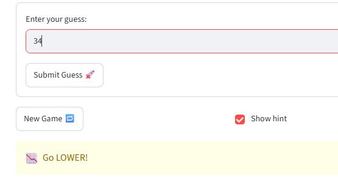
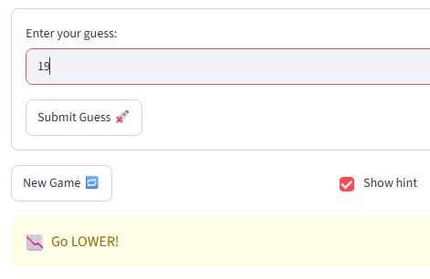
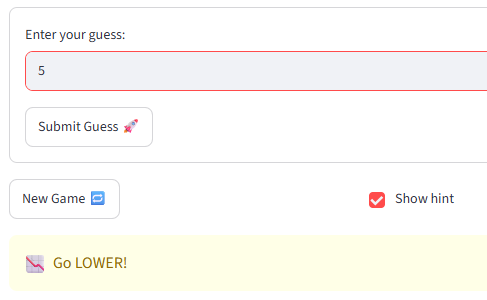
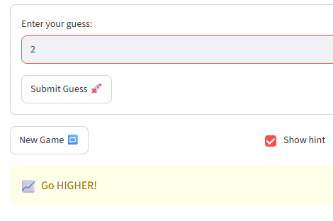
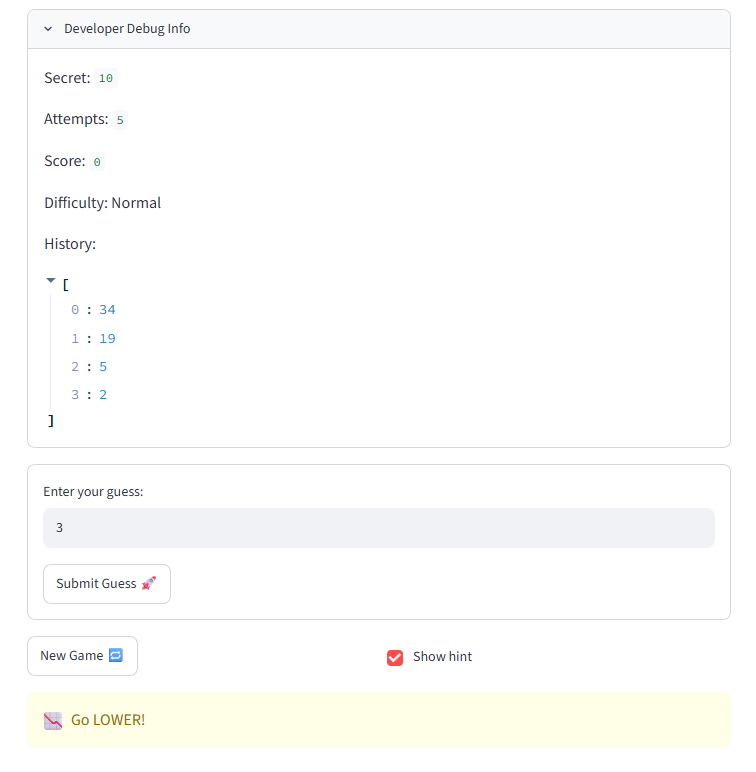
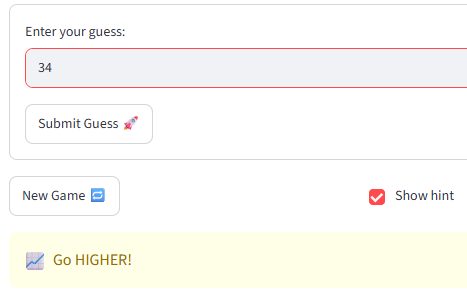
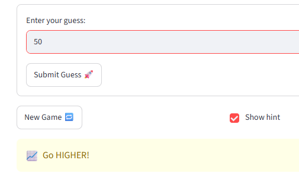
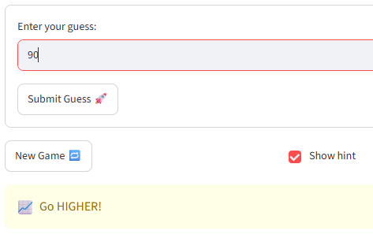
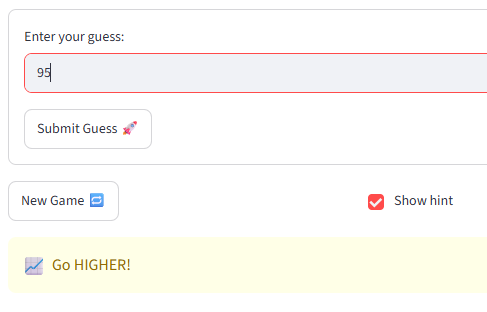
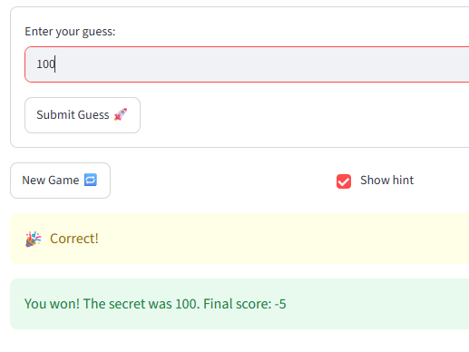

# 🎮 Game Glitch Investigator: The Impossible Guesser

## 🚨 The Situation

You asked an AI to build a simple "Number Guessing Game" using Streamlit.
It wrote the code, ran away, and now the game is unplayable. 

- You can't win.
- The hints lie to you.
- The secret number seems to have commitment issues.

## 🛠️ Setup

1. Install dependencies: `pip install -r requirements.txt`
2. Run the broken app: `python -m streamlit run app.py`

## 🕵️‍♂️ Your Mission

1. **Play the game.** Open the "Developer Debug Info" tab in the app to see the secret number. Try to win.
2. **Find the State Bug.** Why does the secret number change every time you click "Submit"? Ask ChatGPT: *"How do I keep a variable from resetting in Streamlit when I click a button?"*
3. **Fix the Logic.** The hints ("Higher/Lower") are wrong. Fix them.
4. **Refactor & Test.** - Move the logic into `logic_utils.py`.
   - Run `pytest` in your terminal.
   - Keep fixing until all tests pass!

## 📝 Document Your Experience

- [ ] Describe the game's purpose.
The game was meant to let the player guess the target number using feedback from hints.
- [ ] Detail which bugs you found.
As mention in the reflection section:
1. The hints did not align to the target and number guessed. 
2. The Enter key did not actually submit the test number
3. Start new game didn't start a new game. I had to reload the page
- [ ] Explain what fixes you applied.
I reversed the feedback to reflect the test number's actual position relative to the target
The AI model especially helped with the other two bugs, stating that the issues came from the independent widgets that affect the text input and st.button (for bug 2), and the handler reseting attempts and secret, but never status (for bug 3).

## 📸 Demo Walkthrough

Describe your fixed game in numbered steps so a reader can follow along without watching a video:

1. User guesses 34, 19, 5
2. Game returns "Go Lower"
3. The user then guesses 2
4. The game returns "Go Higher"
5. The user continues till they run out of attempts or they guess the target number.

**Screenshot** *(optional)*: <!-- Insert a screenshot of your fixed, winning game here -->










Figured there is still an error in the logic for feedback. 
Going back to work on it. 









 

Finally made it. Yay!!!

## 🧪 Test Results

```
# Paste your pytest output here, e.g.:
# pytest tests/
# ========================= X passed in 0.XXs =========================

....................                       [100%]
28 passed in 0.04s
```

## 🚀 Stretch Features

- [ ] [If you choose to complete Challenge 4, describe the Enhanced UI changes here — a screenshot is optional]
